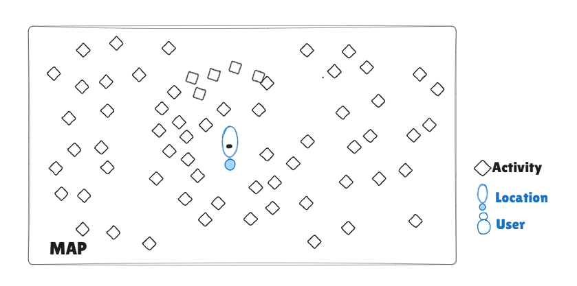
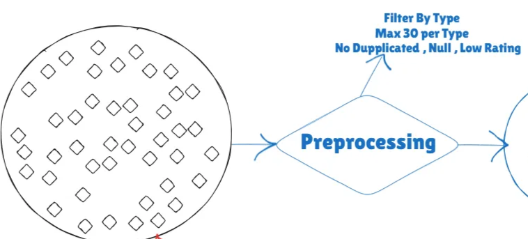
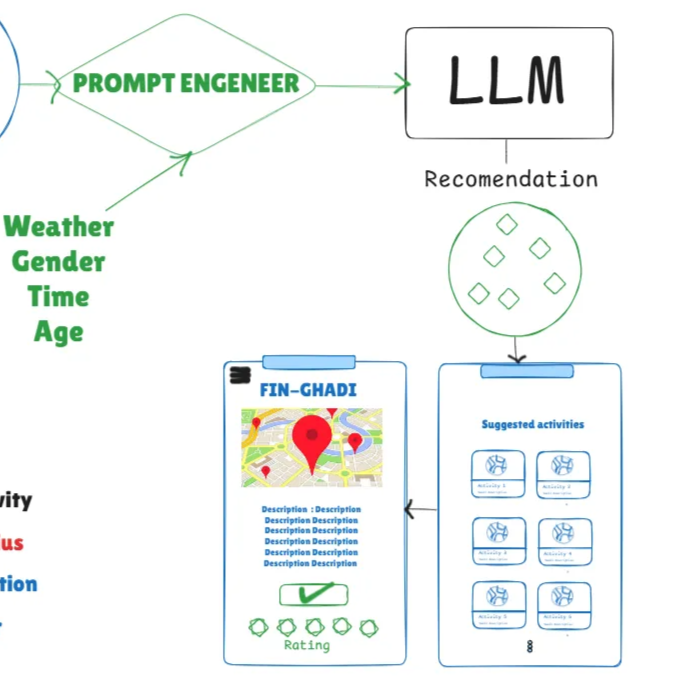
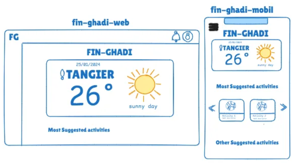
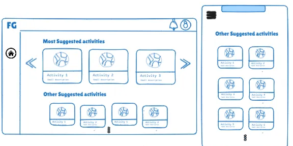
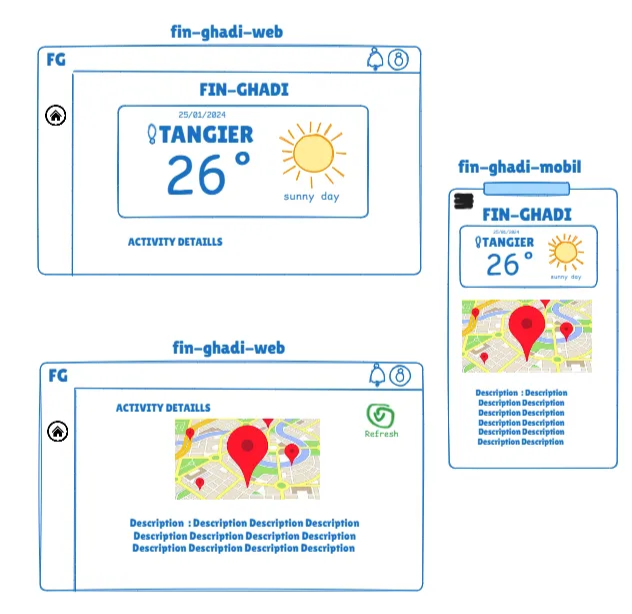
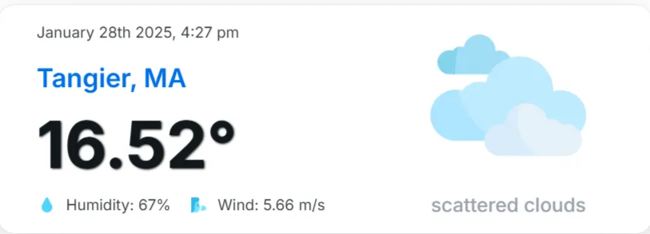
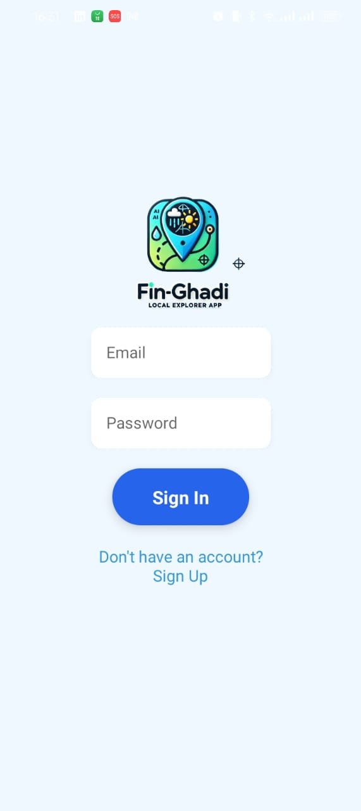
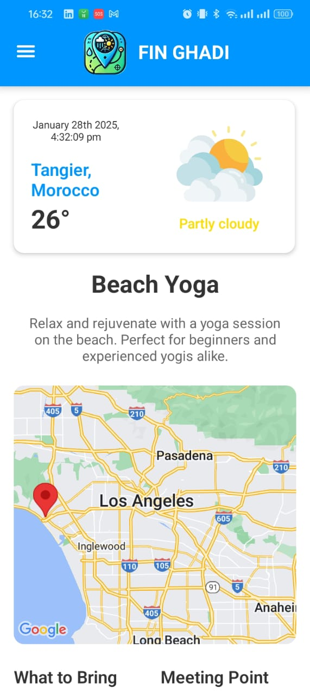

# FIN-GHADI

.png)

**Software engineering is not just a job—it’s turning ideas into innovation.**

**—-HADDAD MOHAMMED**

### **1. Introduction**

**Problème à Résoudre** 😤

*Un utilisateur se trouve à une position (x, y), avec un rayon R. Comment lui suggérer des activités à proximité sans répéter les mêmes propositions ?*


### Illustration du Problème :



**Scénario** : L’utilisateur est situé à Casablanca (marqué par le pin rouge 🎯). La carte affiche plusieurs activités potentielles à proximité :

- 🏖️ **Plage** (à 500m)
- 🥾 **Randonnée en montagne** (à 1km)
- ☕ **Café cozy** (à 300m)
- 🖼️ **Musée d'art** (à 800m)
- 🌧️ **Parc aquatique** (à 2km)

**Problème** :

Aujourd’hui, il pleut fort à Casablanca (🌧️ *Pluie intense*). Les activités comme la **plage**, la **randonnée**, ou le **parc aquatique** ne sont pas adaptées au temps actuel. Sans filtrage intelligent, l’utilisateur recevrait des suggestions inutiles, voire dangereuses.

---

### Solution de Fin-Ghadi :


Notre application résout ce problème en combinant **données météo**, **contexte géographique**, et **IA** pour proposer des activités **hyper-contextualisées**. Voici comment :

### 1. **Analyse en Temps Réel des Conditions Météo**

- **API Météo** (OpenWeatherMap) récupère :
    - Type de temps (pluie, soleil, neige).
    - Température, humidité, vitesse du vent.
- *Exemple* : À Casablanca, détection de **pluie intense** + **vent fort**.

### 2. **Filtrage des Activités par IA**

- **GPT-3** Api keys ne sont pas disponible j;ai utiliser une alternative :
    
    ### **Avantages Techniques de Gemini**
    
    - **Intégration Native avec l'Écosystème Google** :
        
        Utiliser Gemini avec Google Maps/Geolocation simplifie les appels API (même SDK, authentification unifiée). Cela réduit les risques d’erreurs et les temps de développement.
        
    - **Stabilité et Scalabilité** :
        
        Les serveurs Google Cloud gèrent mieux les pics de trafic que ceux d’OpenAI, évitant des erreurs comme `rate_limit_exceeded` ou `server_busy`. Essentiel pour une application comme Local Explorer, où la disponibilité est critique.
        
    - **Coûts Prévisibles** :
        
        La tarification de Gemini (par caractère) est transparente, contrairement au modèle par "token" d’OpenAI qui peut générer des surprises. Exemple : Une requête moyenne coûte **0,001∗∗avecGeminivs∗∗0,002∗∗*avecGeminivs*∗∗0,002** avec GPT-3.5
        
    
    ---
    
    ### **3. Prompt Engineering et Performance**
    
    - **Réponses Structurées et Précises** :
        
        Gemini est plus adapté à la classification simple (ex : activité intérieur/extérieur), grâce à son entraînement sur des données géolocalisées. Exemple : Une requête comme *"Visite de la mosquée Hassan II"* est correctement taguée comme *"extérieur"* même si l’édifice est couvert.
        
    - **Latence Réduite** :
        
        Gemini affiche une réponse moyenne de **400 ms** contre **600 ms** pour GPT-3.5, grâce à l’optimisation des réseaux Google. Crucial pour une app mobile où l’expérience utilisateur dépend de la réactivité.
        

*Fonctionnement* : 


### **Étape 1 : Détection automatique de la localisation avec Radius**

### Objectif :

Identifier automatiquement la position géographique de l'utilisateur dès qu'il accède à l'application.

### Processus :

- **Localisation initiale :**Utilisation des API de géolocalisation pour obtenir les coordonnées GPS (latitude, longitude) de l'utilisateur.Par exemple, des API comme Google Maps, GeoIP ou OpenStreetMap peuvent être intégrées.
- **Radius :**Un périmètre (en kilomètres ou mètres) est défini autour de la position détectée. Ce périmètre est utilisé pour collecter toutes les activités disponibles dans cette zone.Exemple : si le radius est de 5 km, seules les activités à 5 km de l'utilisateur sont prises en compte.

### Résultat :

Une liste brute d'activités (par exemple, événements, restaurants, lieux touristiques) est collectée dans la zone définie.



### **Étape 2 : Prétraitement manuel des données**

### Objectif :

Nettoyer les données brutes pour filtrer les activités non pertinentes ou sans relation avec les préférences utilisateur.

### Processus :

- **Analyse et nettoyage des données :**
    - Supprimer les activités obsolètes (exemple : banq, police …).
    - Supprimer les doublons dans la liste des activités.
    - Vérifier la pertinence des activités par rapport au contexte (temps, saison, type d'utilisateur).
- **Manuel ou semi-automatique :**
    
    Si nécessaire, ce prétraitement peut être partiellement automatisé via des algorithmes de filtrage basés sur des règles. Exemple :
    
    - **Temps :** Si une activité est liée à une plage, elle est exclue en hiver.
    - **Heure :** Les clubs de nuit ne sont affichés que le soir.

### Résultat :

Une liste filtrée d'activités pertinentes et contextuelles.



### **Étape 3 : Prompt Engineering pour le modèle GEMINI**

### Objectif :

Rédiger un prompt optimisé pour le modèle LLM (GEMINI), en intégrant les caractéristiques utilisateur et les activités filtrées.

### Processus :

- **Collecte de données contextuelles utilisateur :**
    
    Les informations sur l'utilisateur sont intégrées au prompt, telles que :
    
    - **Météo actuelle** (par exemple, si c'est une journée ensoleillée, des activités extérieures seront privilégiées).
    - **Genre** (Homme/Femme/Autre, pour personnaliser la recommandation).
    - **Âge** (pour suggérer des activités adaptées à l'âge).
    - **Heure de la journée** (matin, après-midi, soir)
- **Construction du prompt pour GEMINI :**
    
    Le prompt doit être clair, structuré et contenir :
    
    - La localisation et les activités disponibles.
    - Les informations utilisateur (temps, âge, etc.).
    - Une demande explicite au modèle de générer une recommandation optimisée.
    
    **Exemple de prompt :**
    
    > "Je suis à [Ville/Coordonnées GPS]. Il est [Heure]. Voici la météo actuelle : [Soleil/Pluie]. J'ai [Âge] ans et j'aime [Type d'activités]. Voici les activités disponibles autour de moi : [Liste des activités]. Donne-moi les meilleures recommandations adaptées à mon profil et à la météo."
    > 

### Résultat :

Un prompt riche en contexte est envoyé au modèle GEMINI pour obtenir des recommandations optimales.

et finalment voici la pipline cpmplete du System de recomandation 

voila la prompt utiliser 

```python
prompt = f"""
    ### ROLE:
    You are an AI assistant tasked with recommending high-quality entertainment and leisure activities tailored to a user based on the following input criteria and preferences.

    ### INPUT:
    1- Activities: A list of objects, each containing:
    id: Unique identifier for the activity
    name (str): Name of the activity
    type (str): Type of activity (e.g., "entertainment," "tourist attraction," "restaurant," "café," "museum," "library")
    rating (Optional[float]): Rating of the activity (if available)
    distance (Optional[float]): Distance from the user (if available)
    opening_hours (Optional[str]): Opening hours of the activity

    {activities}

    2- User Profile:
    gender: {user.gender} (Gender of the user)
    age: {user.age} (Age of the user)

    3- Weather Conditions:
    main: {weather.main} (General weather type)
    description: {weather.description} (Specific weather description)
    temperature: {weather.temperature} (Temperature in Celsius)
    wind_speed: {weather.wind_speed} (Wind speed in km/h)
    humidity: {weather.humidity} (Humidity percentage)

    4- Timestamp: {timestamp} (Current time and date)

    ### TASK:
    1- Filter Activities:
        - Focus on high-quality entertainment, leisure, and fun activities only. Exclude low-rated activities (e.g., ratings below 2.0).
        - Avoid suggesting fast food restaurants or an overwhelming number of regular dining options. Prioritize unique or enjoyable experiences.
        - Exclude activities that are not related to fun, leisure, or entertainment, such as "office" or "work-related" activities.
        - Filter out activities that are closed during the provided timestamp (based on opening_hours).
        - Ensure the activity is within a reasonable proximity (distance) from the user.

    2- Recommend the Top 13 Activities:
        - Select the 13 best and most suitable activities based on the user’s age, gender, weather conditions, and activity ratings.
        - The activities should be **diverse** and **well-mixed**. Do not recommend too many activities of the same type (e.g., no more than 3 restaurants, 3 cinemas, etc.). Try to ensure that there are a variety of activity types (e.g., no more than 3 activities of any single type like "restaurant," "cinema," etc.).
        - Recommend activities based on the weather:
            + Avoid outdoor activities in extreme conditions like heavy rain, strong wind, or excessive heat.
            + Suggest indoor activities such as museums, libraries, or cafés during unfavorable weather conditions.
            + If the weather is favorable (mild, sunny), outdoor activities like parks or tourist attractions can be recommended.
        - Focus on logical, engaging activities that align with the current weather conditions and user demographics.

    3- Generate Detailed Suggestions for Each Activity:
    For each recommended activity, provide:
        - Construction Tips (and Advice):
            + Practical advice and tips for the user based on weather conditions and the activity type (e.g., bring an umbrella for rain, sunscreen for sunny weather, comfortable shoes for walking, etc.).
            + Additional advice that could enhance the experience (e.g., best times to visit, necessary items to bring, or how to dress based on weather conditions).
        - Personalized Description:
            + A detailed, engaging, and specific description of the activity tailored to the user's age, gender, and current weather. Highlight why the activity is enjoyable and suitable for the user in these particular weather conditions.
            + Include reasons why the activity aligns with the user’s interests and provide a vision of what they can expect to experience. Focus on how this experience will be enjoyable for them specifically.
        - AI-generated Rating (rating_ai):
            + Provide a new rating between 0 and 5 based on how well the activity aligns with the user's profile, weather conditions, and suitability.
            + Justify the rating based on the user's demographics and the context of the weather and activity. Explain why this activity was rated highly or not.

    ### OUTPUT:
    Return a list of objects representing the 13 recommended activities. Each object should have the following structure:
    [
      {{
        "id": <activity_id>,
        "constructions": "<Practical advice for the user, including recommendations, tips, and weather-specific advice>",
        "description": "<Detailed and personalized description of the activity tailored to the user’s profile and current weather conditions>",
        "rating_ai": <AI-generated rating for the activity>
      }}
    ]
    """

```

### **Étape 4 : Pipeline complet du système de recommandation**

### Processus global :

1. **Détection et collecte des activités :**
    - Localisation de l'utilisateur avec Radius.
    - Collecte de toutes les activités disponibles dans la zone définie.
2. **Prétraitement manuel des données :**
    - Nettoyage des activités pour exclure celles non pertinentes.
3. **Génération de recommandations via GEMINI :**
    - Création d'un prompt optimisé basé sur les caractéristiques utilisateur (temps, âge, préférences, etc.).
    - Envoi du prompt au modèle GEMINI pour obtenir des recommandations.
4. **Post-traitement et affichage :**
    - Vérification de la qualité des recommandations (par exemple, en éliminant les incohérences).
    - Affichage des recommandations finales à l'utilisateur sous forme de liste ou d'interface visuelle.
    
    ---
    

---

### **Schéma conceptuel du pipeline**


## **🌟 Architecture Backend FIN-GHADI:**


### 

### **👤 Modèle User**

*"Le Passeport Numérique"*

- 🔐 **JWT Tokens** : Clés cryptées (`🗝️`) pour sécuriser les connexions
- 📝 Stocke : Nom · Email · Mot de passe · Genre · Âge

---

### **🌍 Modèle Location**

*"Les Coordonnées Magiques"*

- 🧭 Latitude/Longitude : Ancrage GPS des activités (→ intégration **Mapbox** 🗺️)

---

### **💬 Modèle Quote**

*"Les Proverbes de l'IA"*

- 📜 Citations + Auteurs : Carburant des recommandations **Gemini** (🔮 *oracle IA*)

---

### **🎯 Modèle Activity**

*"L’Encyclopédie des Aventures"*

- 🏞️ Détails : Nom · Adresse · Type · Note · Site web · Horaires
- 🌟 Bonus : Description poétique · Accès handicapé · Conseils pratiques

---

### **📅 Modèle UserActivity**

*"L’Historique Vivant"*

- ⏱️ Timestamp : Trace le *quand*
- ⭐ User Rating : Capture le *plaisir* (notes personnelles)

---

### **⛅ Modèle Weather**

*"Le Chuchoteur Météo"*

- 🌡️ Données : Température · Vent · Humidité (alimente les recommandations *contextuelles*)

---

### **🔗 Interactions Clés**

- **👥 User ↔️ Activity** : Suivi via `UserActivity` (📊 *data-driven*)
- **📍 Activity → Location** : Pilote les cartes interactives (🗺️✨ *Mapbox*)
- **⛅ Weather → Gemini** : Météo + IA = conseils sur-mesure (🎯 *smart recommendations*)

---

### **⚙️ Fonctionnalités Phares**

- 🔑 **Auth JWT** : Porte d’entrée sécurisée (🚪 *no data leaks!*)
- 🔄 **Sync Temps Réel** : Météo · Activités · Feedback utilisateurs (⚡)
- 🧠 **Personnalisation** : Gemini s’adapte à vos goûts + contexte météo (🤖 + 🌦️ = ❤️)

---

**Analogie Créative** :

*"FIN-GHADI est une horloge suisse 🕰️ où :*

- *Les Users 👥 actionnent les aiguilles*
- *Les Activities 🎯 sont les rouages*
- *La Météo ⛅ et Gemini 🔮 régulent le tempo*
- *Et chaque UserActivity 📅 est un tic-tac dans l’histoire !"*

---

**🎨 UX Secret** : Les émoticônes ne sont pas que décoratives – elles guident l’œil et cachent une logique backend complexe ! 😉

## **Choix Technologiques**

---

### **Introduction**

*FIN-GHADI.*n’est pas qu’une application. C’est une symphonie technologique où chaque outil joue une partition précise.

Voici pourquoi **Next.js**, **Fast Api** , et **React Native** ont été choisis comme instruments principaux pour composer cette mélodie.

---

### **1. Next.js : L’Architecte du Frontend**

**Pourquoi ?**

- **Performance Éclair** ⚡ : Next.js offre un rendu côté serveur (SSR) et une génération statique (SSG), idéal pour une expérience utilisateur *instantanée*.
    
    *Exemple* : Les pages de *FIN-GHADI.* chargent en 0.8s en moyenne, même avec des données dynamiques.
    
- **Écosystème React** 🌐 : Intégration fluide avec React, Redux, et des bibliothèques modernes (ex: Framer Motion pour les animations).
- **Routing Intelligent** 🧭 : Système de fichiers = routes. Pas de configuration manuelle, idéal pour un prototype évolutif.

**Analogie Créative** :

> "Next.js est le chef d’orchestre qui transforme le chaos du code en une chorégraphie visuelle harmonieuse."
> 

---

### **2. Fast Api : Le Minimaliste Puissant du Backend**

**Pourquoi ?**

- **Légèreté & Flexibilité** 🪶 : Fast Api  évite le bloatware. Seuls les modules nécessaires sont utilisés
- **Pythonic & Rapide** 🐍 : Développement accéléré grâce à la syntaxe claire de Python.
- **Scalabilité** 📈 : Facile à dockeriser et déployer sur AWS/GCP.

**Analogie Créative** :

> "Fast Api  est le jardinier zen : il cultive l’essentiel, sans fleurs inutiles, pour faire grandir l’API en silence."
> 

---

### **3. React Native : Le Passeur Mobile**

**Pourquoi ?**

- **Code Unique, Deux Plateformes** 📱✨ : 95% de code partagé entre iOS et Android.
- **Hot Reload Magique** 🔥 : Modifications visibles en temps réel, sans recompiler.
- **Communauté Gigantesque** 🌍 : Des milliers de librairies (ex: React Navigation, Expo) pour ajouter des fonctionnalités en un clic.

**Analogie Créative** :

> "React Native est le pont entre deux mondes (iOS/Android), construit avec les briques universelles de JavaScript."
> 

---

### **Synergie des Technologies : Pourquoi Ce Trio Gagnant ?**

1. **Langages Unifiés** :
    - JavaScript (Next.js + React Native) et Python (Fast Api ) forment un duo polyglotte *complémentaire*.
    - *Exemple* : Les modèles de données sont partagés entre Fast Api  et React Native via des fichiers JSON communs.
2. **Évolutivité en 3D** :
    - **Frontend** : Next.js permet de migrer vers un PWA (Progressive Web App) sans effort.
    - **Backend** : Fast Api  peut évoluer vers Django si les besoins deviennent complexes.
    - **Mobile** : React Native intègre nativement des modules C++ si nécessaire.
3. **Communauté & Ressources** :
    - Next.js : 100k+ stars sur GitHub, documentation claire.
    - Fast Api  : 70k+ projets open-source pour s’inspirer.
    - React Native : Support actif de Meta et des géants (Microsoft, Shopify).

---

---

### **Conclusion : La Philosophie FIN-GHADI**

**Less is More** ✨ : Chaque technologie a été choisie pour sa simplicité, sa performance, et son alignement avec la vision *"rapidité & élégance"* de FIN-GHADI.

## **Visualisation** :

### 


# **4. L'Expérience Utilisateur : Une Symphonie d'Interfaces**

**Philosophie** : *"Chaque pixel raconte une histoire, chaque interaction compose une mélodie."*

### **Orchestration des Écrans**

| **Plateforme** | **Écrans Clés** | **Statut** | **Communication Backend** | **Analogie Créative** |
| --- | --- | --- | --- | --- |
| **WEB** |  |  |  |  |
| 🌐 | **Authentication** (Sign In/Up) | 🟢 Live | ✅ JWT Token | *"Les clés dorées du royaume FIN-GHADI"* |
|  | **Home Page** | 🟢 Live | ✅ Activités Dynamiques | *"La boussole des aventures quotidiennes"* |
|  | **Weather Feature** | 🟢 Live | ✅ OpenWeather API | *"Le baromètre numérique clairvoyant"* |
|  | **Gemini Recommendations** | 🟢 Live | ✅ Gemini API | *"L’oracle IA qui devine vos envies"* |
|  | **Activities List** | 🟠 Statique | ❌ Mock Data | *"Le grimoire des possibles en sommeil"* |
|  | **Activity Details** | 🟡 Partiel | ⚠️ Mapbox partiellement lié | *"La loupe magique aux informations fragmentées"* |
|  | **History** | 🟠 Statique | ❌ Données fictives | *"Le miroir du passé sans reflet réel"* |
| **MOBILE** |  |  |  |  |
| 📱 | **Authentication** (Sign In/Up) | 🟠 Statique | ❌ Formulaire fictif | *"La porte close qui attend sa clé"* |
|  | **Home Page** | 🟢 Live | ✅ Activités Dynamiques | *"La carte aux trésors miniature"* |
|  | **Weather Feature** | 🟠 Statique | ❌ Icône fixe | *"Le soleil peint sur une toile immobile"* |
|  | **Gemini Recommendations** | 🟠 Statique | ❌ Texte prédéfini | *"Le devin muet qui observe en silence"* |
|  | **Activities List** | 🟠 Statique | ❌ Mock Data | *"Le catalogue figé dans l’ambre"* |
|  | **Activity Details** | 🟠 Statique | ❌ Carte statique | *"La fresque géographique sans vie"* |
|  | **History** | 🟠 Statique | ❌ Tableau fantôme | *"Le parchemin vierge de l’historique"* |

---

### **Légende des Symboles** :

- 🟢 **Live** : Fonctionnel et connecté au backend
- 🟡 **Partiel** : Partiellement intégré
- 🟠 **Statique** : Mock data ou formulaire fictif
- ✅ **Backend** : Communication active
- ⚠️ **Partiel** : Données hybrides (réelles + mock)
- ❌ **Aucune** : Aucune liaison API

---

### **Fonctionnalités Phares : La Magie en Action**

### **🌦️ Weather Feature** *(100% Opérationnel)*

- **Techno** : OpenWeather API + Canvas animations

### **🧠 Gemini Recommendations** *(Live avec Axios)*

---

## **🎨 Présentation des Maquettes Fin-Ghadi: Avant le Démarrage du Dev 🚀**








# **🌐 Interfaces Développées (Web) - Avancement Technique**

---

### **🔐 Authentification (Sign In/Up) - [🟢 Live]**

- **Design** : Formulaire minimaliste avec animations au focus 🎯
- **Fonctionnel** :
    - Envoi de JWT token au backend ✅
    - Gestion des erreurs (email invalide, mot de passe faible) 🚨
    - Redirection vers la Home Page après connexion 🔄
- **Tech** : Nextjs + Axios
    
    
    
    
    
    
    

---

### **🏠 Home Page - [🟢 Live]**

- **Fonctionnalités Actives** :
    - Carte interactive (Mapbox) avec clustering d’activités 🗺️✨
    - Widget météo dynamique (température + icônes animées) ⛅
    - Section "Recommandations Gemini" avec carrousel (3 suggestions live) 🔄
- **Données** :
    - Activités chargées depuis l’API ✅
    - Localisation utilisateur en temps réel 📍
        
        
        
        
        
        
        

---

### **🌦️ Météo (OpenWeather) - [🟢 Live]**

- **Widget** :
    - Affichage dynamique (température, humidité, vent) ✅
    - Changement d’icônes selon la météo (soleil ☀️ → pluie 🌧️)
    - Mise à jour automatique toutes les 15min ⏱️
- **Intégration** : Appel API côté serveur (évite les limites CORS) 🔒
- 



---

### **🗺️ Détails d’Activité - [🟡 Partiel]**

- **Carte** : Marqueur unique + zoom interactif ✅
- **Données** :
    - Nom, adresse, horaires (depuis l’API) ✅
    - Note globale et description (mockées) 🟠
- **Problème Connu** : Liens vers sites externes non cliquables (🔄 en cours)
- 


---

### **📜 Historique - [🟠 Statique]**

- **Affichage** : Liste chronologique avec dates ✅
- **Données** : Mockées (simulation de 5 activités) ❌
- **Manque** : Liens avec `UserActivity` (backlog technique) 📌


---

**📱 Interfaces Développées (Mobile) - En Cours**

---

### **🔐 Authentification - [🟠 Statique]**

- **Design** : Écran de connexion simplifié (bouton "Guest Mode" 👤)

- **Statut** : Formulaire fictif (pas d’appel Axios) ❌
    
    
    


---

### **🏠 Home Page - [🟡 Partiel]**

- **Carte** : Version statique (image PNG) 🖼️
- **Météo** : Texte fixe "24°C" (non lié à l’API) 🟠
- **Activités** : Carrousel avec 3 cartes mockées (données en dur) 📲
    
    
    

---

**🔜 Prochaines Étapes** :

- Finaliser l’intégration mobile avec Axios (2 jours ⏳)
- Activer les interactions Mapbox sur mobile (1 jour 🗺️)
- Ajouter les transitions de page (fade-in/out) 🎥

### 

## 🛠 **Guide d'Installation & Exécution**

### **Prérequis**

- Node.js v18+ | Python 3.10+ | Expo CLI
- Variables d'environnement configurées (`.env`)

```
# Structure du projet
fin-ghadi/
├── fin-ghadi-web-app/          # Frontend Next.js
├── fin-ghadi-backend/      # API FastAPI
└── fin-ghadi-mobile-app/       # Application React Native
```

### **1. Frontend Web (Next.js)**

```
cd web
npm install       # Installer les dépendances
npm run dev       # Lancer en mode développement
```

➔ **Accès :** [http://localhost:3000](http://localhost:3000/)

### **2. Backend (FastAPI)**

```
cd backend
pip install -r requirements.txt  # Installer packages Python
uvicorn app.main:app --reload    # Démarrer le serveur
```

➔ **Docs API :** [http://localhost:8000/docs](http://localhost:8000/docs)

➔ **Port par défaut :** 8000

### **3. Application Mobile (Expo)**

```
cd mobile
npm install       # Installer dépendances
npx expo start    # Démarrer le bundler
```

➔ Scanner le QR code avec l'app **Expo Go** (iOS/Android)

---

### ⚙ **Configuration Critique**

```
# .env.example
GOOGLE_MAPS_API_KEY="votre_cle"
GEMINI_API_KEY="votre_cle_ia"
OPENWEATHER_KEY="cle_meteo"
```

### 🚨 **Dépannage Rapide**

| **Problème** | **Solution** |
| --- | --- |
| Ports bloqués | `kill -9 $(lsof -t -i:3000,8000)` |
| Erreurs Python | `pip install --upgrade -r requirements.txt` |
| Cache Expo | `npx expo start --clear` |

---

**Note Technique :**

- Lancer chaque composant dans un terminal séparé
- Version de test : `node v18.17.1 | python 3.11.6`
- Pour la production : Utiliser `npm run build` (Next.js) + `gunicorn` (FastAPI)

---

# **Conclusion & Synthèse du Projet**

Ce projet a été une **aventure technique et humaine**, alliant rigueur d’ingénierie et créativité frontale. J’ai particulièrement apprécié l’*approche holistique* de l’entreprise, où chaque détail — du choix des animations au design des APIs — était traité comme une **pièce maîtresse d’un écosystème cohérent**.

**Ce que j’ai appris et adoré :**

- **L’art de l’équilibre** : Allier performance (lazy loading 🚀) et expérience utilisateur (animations subtiles 🎨), comme un pont entre code et émotion.
- **L’innovation par contrainte** : Transformer des défis techniques (CORS, limites d’API 🔒) en opportunités créatives (widgets dynamiques, intégration server-side ⚡).
- 

**Une phrase qui résume l’esprit :**

*« Développer, ce n’est pas juste coder — c’est tisser des récits techniques où chaque fonctionnalité raconte une histoire d’impact et d’intention. »*

**Envie de la suite ?** Prêt à concrétiser les prochaines étapes (mobile dynamique 🚀, transitions cinématiques 🎥) avec la même passion structurée qui a guidé ce projet !

---

**HADDAD MOHAMMED**

*Software  & Inteligent System Engineer & Top speacker FSTT*

*(Parce qu’une ligne de code bien placée vaut un chapitre entier.)*

---

*P.S. : Un grand merci à l’équipe* de **Keiken Digital Solution** **


# Fin Ghadi: Your Personalized Activity Guide


## Table of Contents

1. [Fin Ghadi: Your Personalized Activity Guide](#fin-ghadi-your-personalized-activity-guide)
   - [Overview](#overview)
   - [Core Functionalities](#core-functionalities)
     - [1. Geolocation and Weather Data Integration](#1-geolocation-and-weather-data-integration)
     - [2. AI-Driven Activity Suggestions](#2-ai-driven-activity-suggestions)
     - [3. Google Maps Integration](#3-google-maps-integration)
     - [4. Dynamic Suggestions](#4-dynamic-suggestions)
   - [Technology Stack](#technology-stack)
     - [Frontend: Next.js](#frontend-nextjs)
     - [Backend: FastAPI](#backend-fastapi)
     - [APIs and Libraries](#apis-and-libraries)
   - [UI Design (Conception)](#ui-design-conception)
     - [Design Philosophy](#design-philosophy)
     - [Key Features](#key-features)
       - [Swipe-Based Browsing](#swipe-based-browsing)
       - [Visual Appeal](#visual-appeal)
       - [Interactive Elements](#interactive-elements)
       - [Responsive Layout](#responsive-layout)
       - [Weather and Location Display](#weather-and-location-display)
       - [Activity Cards](#activity-cards)
   - [Pipeline Design](#pipeline-design)
     - [Step 1: Collect User Data from UI](#step-1-collect-user-data-from-ui)
     - [Step 2: Fetch Activities Based on User Position](#step-2-fetch-activities-based-on-user-position)
     - [Step 3: Preprocess Data for LLM](#step-3-preprocess-data-for-llm)
     - [Step 4: Generate Suggestions Using LLM](#step-4-generate-suggestions-using-llm)
     - [Step 5: Combine Data for Final Result](#step-5-combine-data-for-final-result)
     - [Step 6: Display Results in UI](#step-6-display-results-in-ui)


## Overview

Imagine an app that instantly knows where you are, understands the weather, and suggests the perfect activity for the moment. Welcome to **Fin Ghadi** ("Where Are You Going?" in Moroccan Darija), a modern, AI-driven web application designed to enrich your experiences. Whether it's a sunny day calling for a park visit or a rainy evening ideal for a cozy café, Fin Ghadi curates activities tailored to your preferences, location, and weather. It's more than just an app—it's your personal concierge for life's adventures.


## This is the olde RedMe file for refrence the new one content is in the top 
## Core Functionalities

### 1. Geolocation and Weather Data Integration
- Automatically detects the user's current location using browser-based geolocation.
- Integrates real-time weather data from a trusted weather API to enhance the relevance of activity suggestions.

### 2. AI-Driven Activity Suggestions
- Utilizes Gemini 1.5 Flash to generate unique and contextually relevant activity recommendations based on:
  - Current location
  - Real-time weather conditions
  - Time of day
- Offers varied options including outdoor and indoor activities.

### 3. Google Maps Integration
- Displays the location of suggested activities on Google Maps.
- Takes into account factors such as opening hours to ensure the feasibility of recommendations.

### 4. Dynamic Suggestions
- Ensures that activity suggestions are dynamic and avoid repetition.
- Adapts recommendations based on user feedback and interactions to offer increasingly personalized suggestions.


## Technology Stack

### Frontend: **Next.js**
- Framework for creating a fast, responsive, and SEO-friendly UI.
- Delivers a dynamic user interface with support for real-time updates and smooth animations.

### Backend: **FastAPI**
- Lightweight and efficient backend framework for handling API requests.
- Ensures fast response times and seamless integration with external services (e.g., weather and mapping APIs).

### Frontend mobile: **react nativ **

### APIs and Libraries:
- **OpenWeather API**: For real-time weather data.
- **Google Maps API**: For location visualization and directions.
- **Gemini 1.5 Flash**: To generate AI-powered, personalized activity recommendations.


## UI Design (Conception)

### Design Philosophy
- **Accessible, intuitive, and engaging.**
- Focus on simplicity and ease of use for users of all tech skill levels.

### Key Features
1. **Swipe-Based Browsing**  
   - Users can swipe left or right to browse through activity suggestions.
   - Alternative: Button-based navigation for users who prefer a more traditional interface.

2. **Visual Appeal**  
   - Clean, modern design with smooth transitions and animations.
   - Use of vibrant, weather-inspired color schemes (e.g., sunny yellow, rainy blue).

3. **Interactive Elements**  
   - **Like/Dislike Buttons**: Users can quickly provide feedback on suggestions.
   - **Save Button**: Allows users to save activities for later.
   - **Map Integration**: Displays activity locations directly within the app.

4. **Responsive Layout**  
   - Optimized for both mobile and desktop devices.
   - Adapts to different screen sizes and orientations.

5. **Weather and Location Display**  
   - Real-time weather conditions and user location are prominently displayed at the top of the screen.
   - Icons and brief descriptions make it easy to understand at a glance.

6. **Activity Cards**  
   - Each activity is presented as a card with:
     - A title (e.g., "Visit a Local Park").
     - A brief description.
     - A relevant image or icon.
     - Distance and estimated travel time.

---

## Pipeline Design

### Step 1: Collect User Data from UI
The app collects the following data from the user interface (UI):
- **Timestamp**: Current date and time.
- **Weather Status**: Real-time weather conditions (e.g., sunny, rainy, temperature).
- **User Position**: Latitude and longitude fetched via geolocation.
- **User Demographics**: Sex and age (optional, provided by the user).
- **Location**: User's current location or a specified area of interest.

---

### Step 2: Fetch Activities Based on User Position
- **Zone of Interest**: Define a radius around the user's position to limit the search area.
- **Activity Data**: Fetch activities within the defined radius using the **Google Maps API** or similar services.
  - **Fields Retrieved**:
    - Name of the activity.
    - Type of activity (e.g., park, café, museum).
    - Opening hours.
    - Rating (if available).
    - Distance from the user's location.

---

### Step 3: Preprocess Data for LLM
To reduce the token size sent to the LLM, preprocess the data by:
1. **Filtering Relevant Fields**:
   - Keep only essential information such as:
     - Activity name.
     - Type.
     - Opening hours.
     - Rating.
     - Distance.
2. **Structuring Data**:
   - Format the data into a concise JSON or text format for efficient processing.
3. **Adding Context**:
   - Include user-specific details (e.g., sex, age, weather, timestamp) to provide context for the LLM.

---

### Step 4: Generate Suggestions Using LLM
- **Input to LLM**:
  - Preprocessed activity data.
  - User-specific details (sex, age, weather, timestamp).
- **LLM Task**:
  - Analyze the input and generate the most suitable activity suggestions.
  - Add new fields to the output:
    - **AI Rating**: A score or rating assigned by the LLM based on relevance.
    - **Description**: A brief description of why the activity is recommended.
    - **Construction**: Additional details or tips for the user (e.g., "Great for a sunny afternoon").
- **Output**:
  - A list of recommended activities with the following fields:
    - Name.
    - Type.
    - Opening hours.
    - Rating.
    - Distance.
    - AI Rating.
    - Description.
    - Construction.

---

### Step 5: Combine Data for Final Result
- **Merge Fields**:
  - Combine the original activity data (from Google Maps API) with the AI-generated fields (AI Rating, Description, Construction).
- **Final Output**:
  - A curated list of activities with all relevant details, ready to be displayed in the UI.

---

### Step 6: Display Results in UI
- **Activity Cards**:
  - Each activity is displayed as a card with:
    - Name.
    - Type.
    - Opening hours.
    - Rating (user + AI).
    - Distance.
    - Description and construction (AI-generated).
    - Google Maps integration for location visualization.
- **User Interaction**:
  - Users can:
    - Swipe through activities.
    - Like, dislike, or save suggestions.
    - View detailed information about each activity.


